# 第一节 无界非阻塞队列 ConcurrentLinkedQueue 原理探究

## 一、 前言

常用的并发队列有阻塞队列和非阻塞队列，前者使用锁实现，后者则使用CAS非阻塞算法实现，使用非阻塞队列一般性能比较好，下面就看看常用的非阻塞ConcurrentLinkedQueue是如何使用CAS实现的。

## 二、 ConcurrentLinkedQueue类图结构

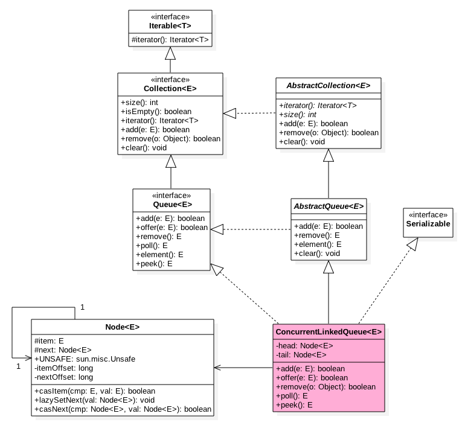

如图ConcurrentLinkedQueue中有两个volatile类型的Node节点分别用来存在列表的首尾节点，其中head节点存放链表第一个item为null的节点，tail则并不是总指向最后一个节点。Node节点内部则维护一个变量item用来存放节点的值，next用来存放下一个节点，从而链接为一个单向无界列表。

````Java
// 无惨构造
public ConcurrentLinkedQueue() {
    head = tail = new Node<E>(null);
}
````
如上代码初始化时候会构建一个item为NULL的空节点作为链表的首尾节点。

##　三、offer操作

offer操作是在链表末尾添加一个元素，下面看看实现原理。

````java
public boolean offer(E e) {
    //e为null则抛出空指针异常
    checkNotNull(e);
    //构造Node节点构造函数内部调用unsafe.putObject，后面统一讲
    final Node<E> newNode = new Node<E>(e);

    //从尾节点插入
    for (Node<E> t = tail, p = t;;) {
        Node<E> q = p.next;
        //如果q=null说明p是尾节点则插入
        if (q == null) {
            //cas插入（1）
            if (p.casNext(null, newNode)) {
                //cas成功说明新增节点已经被放入链表，然后设置当前尾节点（包含head，1，3，5.。。个节点为尾节点）
                if (p != t) // hop two nodes at a time
                    casTail(t, newNode);  // Failure is OK.
                return true;
            }
            // Lost CAS race to another thread; re-read next
        }
        else if (p == q)//(2)
            //多线程操作时候，由于poll时候会把老的head变为自引用，然后head的next变为新head，所以这里需要
            //重新找新的head，因为新的head后面的节点才是激活的节点
            p = (t != (t = tail)) ? t : head;
        else
            // 寻找尾节点(3)
            p = (p != t && t != (t = tail)) ? t : q;
    }
}
````

````java
/**
 * compareAndSwapObject(Object var1, long var2, Object var3, Object var4)
 * var1 操作的对象
 * var2 操作的对象属性
 * var3 var2与var3比较，相等才更新
 * var4 更新值
 */
 return UNSAFE.compareAndSwapObject(this, nextOffset, cmp, val);
````

从构造函数知道一开始有个item为null的哨兵节点，并且head和tail都是指向这个节点，然后当一个线程调用offer时候首先

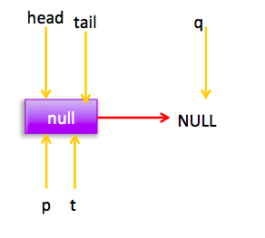

如图首先查找尾节点，q==null,p就是尾节点，所以执行p.casNext通过cas设置p的next为新增节点，这时候p==t所以不重新设置尾节点为当前新节点。由于多线程可以调用offer方法，所以可能两个线程同时执行到了（1）进行cas，那么只有一个会成功（假如线程1成功了），成功后的链表为：

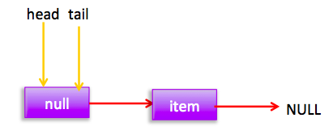

失败的线程会循环一次这时候指针为：

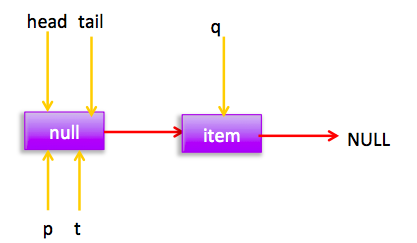

这时候会执行（3）所以p=q,然后在循环后指针位置为：

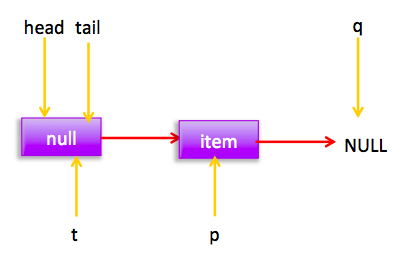

所以没有其他线程干扰的情况下会执行（1）执行cas把新增节点插入到尾部，没有干扰的情况下线程2 cas会成功，然后去更新尾节点tail,由于p!=t所以更新。这时候链表和指针为：

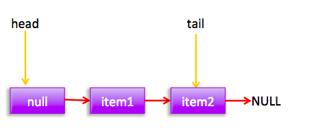

假如线程2cas时候线程3也在执行，那么线程3会失败，循环一次后，线程3的节点状态为：

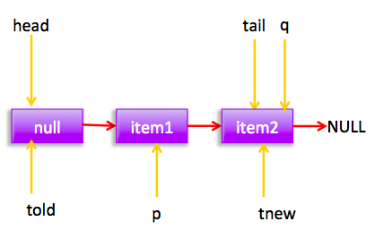

这时候p!=t ；并且t的原始值为told，t的新值为tnew ,所以told!=tnew，所以 p=tnew=tail;

然后在循环一下后节点状态:

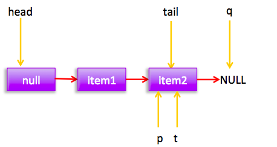

q==null所以执行（1）。

现在就差p==q这个分支还没有走，这个要在执行poll操作后才会出现这个情况。poll后会存在下面的状态

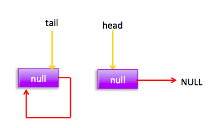

这个时候添加元素时候指针分布为：

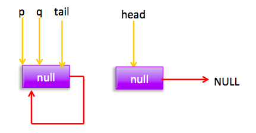

所以会执行（2）分支 结果 p=head
然后循环，循环后指针分布：

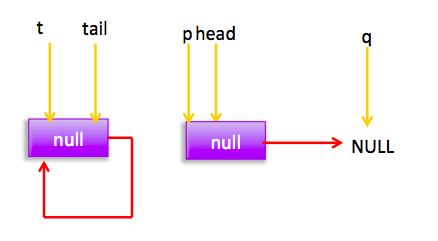

所以执行(1),然后p!=t所以设置tail节点。现在分布图：

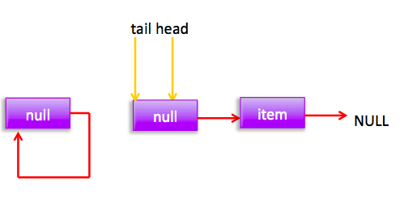

自引用的节点会被垃圾回收掉。


q
