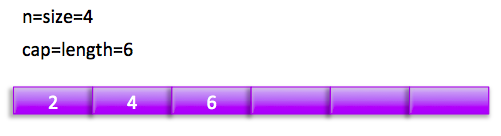
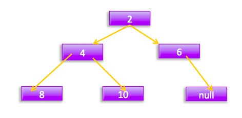

# 第一节 无界阻塞优先级队列 PriorityBlockingQueue 原理探究

## 一、 前言

PriorityBlockingQueue是**带优先级的无界阻塞队列**，每次出队都返回优先级最高的元素，是二叉树最小堆的实现，研究过数组方式存放最小堆节点的都知道，直接遍历队列元素是无序的。

## 二、 PriorityBlockingQueue类图结构


如图PriorityBlockingQueue内部有个数组queue用来存放队列元素，size用来存放队列元素个数，**allocationSpinLockOffset** 是用来在扩容队列时候做cas的，目的是保证只有一个线程可以进行扩容。

由于这是一个优先级队列所以有个比较器comparator用来比较元素大小。lock独占锁对象用来控制同时只能有一个线程可以进行入队出队操作。notEmpty条件变量用来实现take方法阻塞模式。**这里没有notFull条件变量是因为这里的put操作是非阻塞的，为啥要设计为非阻塞的是因为这是无界队列。**

最后PriorityQueue q用来搞序列化的。

如下构造函数，默认队列容量为11，默认比较器为null;
````java
private static final int DEFAULT_INITIAL_CAPACITY = 11;
  public PriorityBlockingQueue() {
    this(DEFAULT_INITIAL_CAPACITY, null);
  }
  public PriorityBlockingQueue(int initialCapacity) {
    this(initialCapacity, null);
  }
  public PriorityBlockingQueue(int initialCapacity, Comparator<? super E> comparator) {
    if (initialCapacity < 1)
      throw new IllegalArgumentException();
    this.lock = new ReentrantLock();
    this.notEmpty = lock.newCondition();
    this.comparator = comparator;
    this.queue = new Object[initialCapacity];
  }
}
````
## 三、 offer操作
在队列插入一个元素，由于是无界队列，所以一直为成功返回true;
````Java
public boolean offer(E e) {
    if (e == null)
        throw new NullPointerException();
    final ReentrantLock lock = this.lock;
    lock.lock();
    int n, cap;
    Object[] array;
    // 如果当前元素个数>=队列容量，则扩容(1)
    while ((n = size) >= (cap = (array = queue).length))
        tryGrow(array, cap);
    try {
        Comparator<? super E> cmp = comparator;
        // 默认比较器为null (2)
        if (cmp == null)
            siftUpComparable(n, e, array);
        else
            // 自定义比较器(3)
            siftUpUsingComparator(n, e, array, cmp);
        // 队列元素增加1，并且激活notEmpty的条件队列里面的一个阻塞线程 (9)
        size = n + 1;
        notEmpty.signal();
    } finally {
        lock.unlock();
    }
    return true;
}
````
主流程比较简单，下面看看两个主要函数
````Java
private void tryGrow(Object[] array, int oldCap) {
  lock.unlock(); // must release and then re-acquire main lock
  Object[] newArray = null;

  // cas成功则扩容 (4)
  if (allocationSpinLock == 0 &&
      UNSAFE.compareAndSwapInt(this, allocationSpinLockOffset,
                               0, 1)) {
      try {
          //oldGap<64则扩容新增oldcap+2,否者扩容50%，并且最大为MAX_ARRAY_SIZE
          int newCap = oldCap + ((oldCap < 64) ?
                                 (oldCap + 2) : // grow faster if small
                                 (oldCap >> 1));
          if (newCap - MAX_ARRAY_SIZE > 0) {    // possible overflow
              int minCap = oldCap + 1;
              if (minCap < 0 || minCap > MAX_ARRAY_SIZE)
                  throw new OutOfMemoryError();
              newCap = MAX_ARRAY_SIZE;
          }
          if (newCap > oldCap && queue == array)
              newArray = new Object[newCap];
      } finally {
          allocationSpinLock = 0;
      }
  }
  // 第一个线程cas成功后，第二个线程会进入这个地方，然后第二个线程让出cpu，尽量让第一个线程执行下面点获取锁，但是这得不到肯定的保证。(5)
  if (newArray == null) // back off if another thread is allocating
      Thread.yield();
  lock.lock();//（6）
  if (newArray != null && queue == array) {
      queue = newArray;
      System.arraycopy(array, 0, newArray, 0, oldCap);
  }
}
````
**tryGrow目的是扩容，这里要思考下为啥在扩容前要先释放锁，然后使用cas控制只有一个线程可以扩容成功。我的理解是为了性能，因为扩容时候是需要花时间的，如果这些操作时候还占用锁那么其他线程在这个时候是不能进行出队操作的，也不能进行入队操作，这大大降低了并发性。**

**所以在扩容前释放锁，这允许其他出队线程可以进行出队操作，但是由于释放了锁，所以也允许在扩容时候进行入队操作，这就会导致多个线程进行扩容会出现问题，所以这里使用了一个spinlock用cas控制只有一个线程可以进行扩容，失败的线程调用Thread.yield()让出cpu，目的意在让扩容线程扩容后优先调用lock.lock重新获取锁，但是这得不到一定的保证，有可能调用Thread.yield()的线程先获取了锁。**

**那copy元素数据到新数组为啥放到获取锁后面那?原因应该是因为可见性问题，因为queue并没有被volatile修饰。另外有可能在扩容时候进行了出队操作，如果直接拷贝可能看到的数组元素不是最新的。而通过调用Lock后，获取的数组则是最新的，并且在释放锁前 数组内容不会变化。**

## 具体建堆算法：
````java
private static <T> void siftUpComparable(int k, T x, Object[] array) {
    Comparable<? super T> key = (Comparable<? super T>) x;
    //队列元素个数>0则判断插入位置，否者直接入队(7)
    while (k > 0) {
        int parent = (k - 1) >>> 1;
        Object e = array[parent];
        if (key.compareTo((T) e) >= 0)
            break;
        array[k] = e;
        k = parent;
    }
    array[k] = key;//（8）
}
````
下面用图说话模拟下过程： 假设队列容量为2

1. 第一次offer(2)时候


执行（1)为false所以执行（2），由于k=n=size=0;所以执行（8）元素入队，然执行（9）size+1;
现在队列状态:


2. 第二次offer(4)时候

执行（1)为false，所以执行（2）由于k=1,所以进入while循环，parent=0;e=2;key=4;key>e所以break;然后把4存到数据下标为1的地方，这时候队列状态为：


3. 第三次offer(6)时候

执行（1)为true,所以调用tryGrow,由于2<64所以newCap=2 + (2+2)=6;然后创建新数组并拷贝，然后调用siftUpComparable；k=2>0进入循环 parent=0;e=2;key=6;key>e所以break;然后把6放入下标为2的地方，现在队列状态：


4. 第四次offer(1)时候

执行（1)为false，所以执行（2）由于k=3,所以进入while循环，parent=0;e=2;key=1; key<e；所以把2复制到数组下标为3的地方，然后k=0退出循环；然后把2存放到下标为0地方，现在状态：


## 四、 poll操作

在队列头部获取并移除一个元素，如果队列为空，则返回null

````java
public E poll() {
    final ReentrantLock lock = this.lock;
    lock.lock();
    try {
        return dequeue();
    } finally {
        lock.unlock();
    }
}
````
主要看dequeue
````java
private E dequeue() {
    //队列为空，则返回null
    int n = size - 1;
    if (n < 0)
        return null;
    else {
        //获取队头元素(1)
        Object[] array = queue;
        E result = (E) array[0];

        //获取对尾元素，并值null(2)
        E x = (E) array[n];
        array[n] = null;

        Comparator<? super E> cmp = comparator;
        if (cmp == null)//cmp=null则调用这个，把对尾元素位置插入到0位置，并且调整堆为最小堆(3)
            siftDownComparable(0, x, array, n);
        else
            siftDownUsingComparator(0, x, array, n, cmp);
        size = n;（4）
        return result;
    }
}
````
````java
private static <T> void siftDownComparable(int k, T x, Object[] array, int n) {
   if (n > 0) {
       Comparable<? super T> key = (Comparable<? super T>)x;
       int half = n >>> 1;           // loop while a non-leaf
       while (k < half) {
           int child = (k << 1) + 1; // assume left child is least
           Object c = array[child]; //（5）
           int right = child + 1;（// 6)
           if (right < n &&
               ((Comparable<? super T>) c).compareTo((T) array[right]) > 0)(7)
               c = array[child = right];
           if (key.compareTo((T) c) <= 0) // (8)
               break;
           array[k] = c;
           k = child;
       }
       array[k] = key; // (9)
   }
}
````

### 下面用图说话模拟下过程：

1. 第一次调用poll()
首先执行（1） result=1；然后执行（2）x=2;这时候队列状态


然后执行（3）后状态为：



执行（4）后的结果：


下面重点说说siftDownComparable这个屌屌的建立最小堆的算法：

首先说下思想，其中k一开始为0，x为数组里面最后一个元素，由于第0个元素为树根，被出队时候要被搞掉，所以建堆要从它的左右孩子节点找一个最小的值来当树根，子树根被搞掉后，会找子树的左右孩子最小的元素来代替，直到树节点为止，还不明白，没关系，看图说话：
假如当前队列元素：


那么对于树为：


这时候如果调用了poll();那么result=2;x=11;现在树为：



然后看leftChildVal = 4;rightChildVal = 6; 4<6;所以c=4;也就是获取根节点的左右孩子值小的那一个； 然后看11>4也就是key>c；然后把c放入树根，现在树为：


然后看根的左边孩子4为根的子树我们要为这个字树找一个根节点

看leftChildVal = 8;rightChildVal = 10; 8<10;所以c=8;也就是获取根节点的左右孩子值小的那一个； 然后看11>8也就是key>c；然后把c放入树根，现在树为：


这时候k=3;half=3所以推出循环，执行（9）后结果为：


这时候队列为：


## 五、 put操作

内部调用的offer,由于是无界队列，所以不需要阻塞

````java
public void put(E e) {
    offer(e); // never need to block
}
````

## 六、 take操作

获取队列头元素，如果队列为空则阻塞。
````java
public E take() throws InterruptedException {
    final ReentrantLock lock = this.lock;
    lock.lockInterruptibly();
    E result;
    try {

        //如果队列为空，则阻塞，把当前线程放入notEmpty的条件队列
        while ( (result = dequeue()) == null)
            notEmpty.await();
    } finally {
        lock.unlock();
    }
    return result;
}

````
这里是阻塞实现，阻塞后直到入队操作调用notEmpty.signal 才会返回。

## 七、 size操作

获取队列元个数，由于加了独占锁所以返回结果是精确的

````java
public int size() {
    final ReentrantLock lock = this.lock;
    lock.lock();
    try {
        return size;
    } finally {
        lock.unlock();
    }
}
````

## 八、 总结

PriorityBlockingQueue类似于ArrayBlockingQueue内部使用一个独占锁来控制同时只有一个线程可以进行入队和出队，另外前者只使用了一个notEmpty条件变量而没有notFull这是因为前者是无界队列，当put时候永远不会处于await所以也不需要被唤醒。

PriorityBlockingQueue始终保证出队的元素是优先级最高的元素，并且可以定制优先级的规则，内部通过使用一个二叉树最小堆算法来维护内部数组，这个数组是可扩容的，当当前元素个数>=最大容量时候会通过算法扩容。

值得注意的是为了避免在扩容操作时候其他线程不能进行出队操作，实现上使用了先释放锁，然后通过cas保证同时只有一个线程可以扩容成功。


dss
