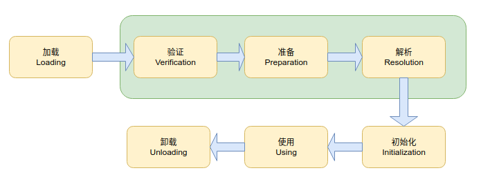

#### Java 类的加载机制

读取.class文件二进制文件--> 验证与解析(格式 关键字 关键词 语法 引用 类型转化等等) --> 初始化 --> 使用 --> 卸载,大致流程如下



从上图中可以明显看出各个阶段是有顺序的，加载、验证、准备、初始化这个5个阶段的顺序是固定的，也就是说类的加载过程必须按照这种顺序按部就班开始；解析阶段则不一定，解析阶段的工作完全可能在初始化之后才开始，之所以这么设计，就是为了支持Java语言的动态绑定。还有一点需要注意的是，虽然上述的5个阶段可能按照顺序开始，但是并不是说一个接一个阶段完成后才开始，一个阶段的进行完全可能激活另一个阶段的进行，``交叉混合式的进行``。

那么什么情况下需要开始类加载过程的第一个阶段，加载到内存中呢？这就不得不涉及两个概念：主动引用和被动引用。根据Java虚拟机的规范，只有5中情况属于主动引用：

* 1.遇到new（使用new 关键字实例化一个对象）、getstatic（读取一个类的静态字段）、putstatic或者invokestatic（设置一个类的静态字段）这4条指令的时候，如果累没有进行过初始化。则需要先触发其初始化。
* 2.使用反射进行反射调用的时候，如果类没有初始化，则需要先触发其初始化。
* 3.当初始化一个类的时候，如果其父类没有初始化，则需要先触发其父类的初始化
* 4.程序启动需要触发main方法的时候，虚拟机会先触发这个类的初始化
* 5.当使用jdk1.7的动态语言支持的时候，如果一个java.lang.invoke.MethodHandler实例最后的解析结果为REF_getStatic、REF_pusStatic、REF_invokeStatic的方法句柄（句柄中包含了对象的实例数据和类型数据，句柄是访问对象的一种方法。句柄存储在堆中），并且句柄对应的类没有被初始化，那么需要先触发这个类的初始化。

5种之外情况就是被动引用。被动引用的经典例子有：

* 1.通过子类引用父类的静态字段,这种情况不会导致子类的初始化，因为对于静态字段，只有直接定义静态字段的类才会被触发初始化，子类不是定义这个静态字段的类，自然不能被实例化。
* 2.通过数组定义来引用类，不会触发该类的初始化``例如， Clazz[] arr = new Clazz[10];并不会触发。``
* 3.常量不会触发定义常量的类的初始化因为常量在编译阶段会存入调用常量的类的常量池中，本质上并没有引用定义这个常量的类，所以不会触发定义这个常量的类的初始化。

对于这5种主动引用会触发类进行初始化的场景，在java虚拟机规范中限定了“有且只有”这5种场景会触发类的加载。

##### 类的加载过程

###### 加载

在加载阶段虚拟机需要完成以下三件事：

* 1.通过一个类的``全限定名称``来获取此类的``二进制字节流``
* 2.将这个字节流所代表的静态存储结构转化为方法区的运行时数据结构
* 3.在内存中生成一个代表这个类的`java.lang.Class`对象，作为方法区这个类的各种数据的访问入口

第一步读取二进制字节流, jvm不关心从哪里获取的二进制字节流,这就对读取进行抽象化,可以冲zip,war,jar,网络,运行时反射等获取

对于类的加载，可以分为数组类型和非数组类型，对于非数组类型可以通过系统的引导类加载器进行加载，也可以通过自定义的类加载器进行加载。这点是比较灵活的。而对于数组类型，数组类本身不通过类加载器进行加载，而是通过Java虚拟机直接进行加载的，那么是不是数组类型的类就不需要类加载器了呢？答案是否定的。因为当数组去除所有维度之后的类型最终还是要依靠类加载器进行加载的，所以数组类型的类与类加载器的关系还是很密切的。

通常一个数组类型的类进行加载需要遵循以下的原则：

* 1.如果数组的组件类型（也就是数组类去除一个维度之后的类型，比如对于二维数组，去除一个维度之后是一个一维数组）是引用类型，那么递归采用上面的过程加载这个组件类型
* 2.如果数组类的组件类型不是引用类型，比如是基本数据类型，Java虚拟机将把数组类标记为与引导类加载器关联
* 3.数组类的可见性与组件类型的可见性是一致的。如果组件类型不是引用类型，那么数组类的可见性是public，意味着组件类型的可见性也是public。

前面已经介绍过，加载阶段与连接阶段是交叉进行的，所以可能加载阶段还没有完成，连接阶段就已经开始。但是即便如此，记载阶段与连接阶段之间的开始顺序仍然保持着固定的顺序。

##### 验证

验证阶段的目的是为了确保Class字节流中包含的信息符合当前虚拟机的要求，并且不会危害虚拟机的安全。

我们知道Java语言具有相对的安全性（这里的安全性体现为两个方面：一是Java语言本身特性，比如Java去除指针，这点可以避免对内存的直接操作；二是Java所提供的沙箱运行机制，Java保证所运行的机制都是在沙箱之内运行的，而沙箱之外的操作都不可以运行）。但是需要注意的是Java虚拟机处理的Class文件并不一定是是从Java代码编译而来，完全可能是来自其他的语言，甚至可以直接通过十六进制编辑器书写Class文件（当然前提是编写的Class文件符合规范）。从这个角度讲，其他来源的Class文件是不可能都保证其安全性的。所以如果Java虚拟机都信任其加载进来的Class文件，那么很有可能会造成对虚拟机自身的危害。

虚拟机的验证阶段主要完后以下4项验证：文件格式验证、元数据验证、字节码验证、符号引用验证。（结合前文，查看Class类文件结构）

##### 文件格式验证

这里的文件格式是指Class的文件规范，这一步的验证主要保证加载的字节流（在计算机中不可能是整个Class文件，只有0和1，也就是字节流）符合Class文件的规范（根据前面对Class类文件的描述，Class文件的每一个字节表示的含义都是确定的。比如前四个字节是否是一个魔数等）以及保证这个字节流可以被虚拟机接受处理。

在Hotspot的规范中，对文件格式的验证远不止这些，但是只有通过文件格式的验证才能进入方法区中进行存储。所以自然也就知道，后面阶段的验证工作都是在方法区中进行的。

##### 元数据验证

元数据可以理解为描述数据的数据，更通俗的说，元数据是描述类之间的依赖关系的数据，比如Java语言中的注解使用（使用@interface创建一个注解）。元数据验证主要目的是对类的元数据信息进行语义校验，保证不存在不符合Java语言规范（Java语法）的元数据信息。

具体的验证信息包括以下几个方面：

* 1.这个类是否有父类（除了java.lang.Object外其余的类都应该有父类）
* 2.这个类的父类是否继承了不允许被继承的类（比如被final修饰的类）
* 3.如果这个类不是抽象类，是否实现了其父类或者接口中要求实现的方法
* 4.类中的字段、方法是否与父类产生矛盾（比如是否覆盖了父类的final字段）

##### 字节码验证

这个阶段主要对类的方法体进行校验分析。通过了字节码的验证并不代表就是没有问题的，但是如果没有通过验证就一定是有问题的。整个字节码的验证过程比这个复杂的多，由于字节码验证的高度复杂性，在jdk1.6版本之后的虚拟机增加了一项优化，Class类文件结构这篇文章中说到过有一个属性：StackMapTable属性。可以简单理解这个属性是用于检查类型是否匹配。

##### 符号引用验证

这个验证是最后阶段的验证，符号引用是Class文件的逻辑符号，直接引用指向的方法区中某一个地址，在解析阶段，将符号引用转为直接引用，这里只进行转化前的匹配性校验。符号引用验证主要是对类自身以外的信息进行匹配性校验。比如符号引用是否通过字符串描述的全限定名是否能够找到对应点类。

* 符号引用（Symbolic Reference）

  符号引用以一组符号来描述所引用的目标，符号引用可以是任何形式的字面量，只要使用时能无歧义的定位到目标即可（符号字面量，还没有涉及到内存）。符号引用与虚拟机实现的内存布局无关，引用的目标并不一定已经加载在内存中。各种虚拟机实现的内存布局可以各不相同，但是他们能接受的符号引用必须都是一致的，因为符号引用的字面量形式明确定义在Java虚拟机规范的Class文件格式中。

* 直接引用（Direct Reference）

  直接引用可以是直接指向目标的指针、相对偏移量或是一个能间接定位到目标的句柄（可以理解为内存地址）。直接引用是与虚拟机实现的内存布局相关的，同一个符号引用在不同的虚拟机实例上翻译出来的直接引用一般都不相同，如果有了直接引用，那引用的目标必定已经在内存中存在。

进行符号引用验证的目的在于确保解析动作能够正常执行，如果无法通过符号引用验证那么将会抛出java.lang.IncomingChangeError异常的子类。

##### 准备

完成了验证阶段之后，就进入准备阶段。准备阶段是正式为变量分配内存空间并且设置类变量初始值。

需要注意的是，这时候进行内存分配的仅仅是类变量（也就是被static修饰的变量），实例变量是不包括的，实例变量的初始化是在对象实例化的时候进行初始化，而且分配的内存区域是Java堆。这里的初始值也就是在编程中默认值，也就是零值。

例如public static int value = 123 ；value在准备阶段后的初始值是0而不是123，因为此时尚未执行任何的Java方法，而把value赋值为123的putStatic指令是程序被编译后，存放在类构造器clinit()方法之中，把value赋值为123的动作将在初始化阶段才会执行。

特殊情况：如果类字段的字段属性表中存在ConstantValue属性，那在准备阶段变量就会被初始化为ConstantValue属性所指定的值，例如public static final int value = 123 编译时javac将会为value生成ConstantValue属性，在准备阶段虚拟机就会根据ConstantValue的设置将变量赋值为123。

##### 解析

解析阶段是将常量池中的符号引用替换为直接引用的过程（前面已经提到了符号引用与直接引用的区别）。在进行解析之前需要对符号引用进行解析，不同虚拟机实现可以根据需要判断到底是在类被加载器加载的时候对常量池的符号引用进行解析（也就是初始化之前），还是等到一个符号引用被使用之前进行解析（也就是在初始化之后）。

到现在我们已经明白解析阶段的时机，那么还有一个问题是：如果一个符号引用进行多次解析请求，虚拟机中除了invokedynamic指令外，虚拟机可以对第一次解析的结果进行缓存（在运行时常量池中记录引用，并把常量标识为一解析状态），这样就避免了一个符号引用的多次解析。

解析动作主要针对的是类或者接口、字段、类方法、方法类型、方法句柄和调用点限定符7类符号引用。这里主要说明前四种的解析过程。

##### 类或者接口解析

要把一个类或者接口的符号引用解析为直接引用，需要以下三个步骤：

* 1.如果该符号引用不是一个数组类型，那么虚拟机将会把该符号代表的全限定名称传递给调用这个符号引用的类。这个过程由于涉及验证过程所以可能会触发其他相关类的加载
* 2.如果该符号引用是一个数组类型，并且该数组的元素类型是对象。我们知道符号引用是存在方法区的常量池中的，该符号引用的描述符会类似”[java/lang/Integer”的形式（描述符的概念详见前文【深入理解JVM】：Class类文件结构），将会按照上面的规则进行加载，虚拟机将会生成一个代表此数组对象的直接引用
* 3.如果上面的步骤都没有出现异常，那么该符号引用已经在虚拟机中产生了一个直接引用，但是在解析完成之前需要对符号引用进行验证，主要是确认当前调用这个符号引用的类是否具有访问权限，如果没有访问权限将抛出java.lang.IllegalAccess异常

##### 字段解析

对字段的解析需要首先对其所属的类进行解析，因为字段是属于类的，只有在正确解析得到其类的正确的直接引用才能继续对字段的解析。对字段的解析主要包括以下几个步骤：

* 1.如果该字段符号引用（后面简称符号）就包含了简单名称和字段描述符都与目标相匹配的字段，则返回这个字段的直接引用，解析结束
* 2.否则，如果在该符号的类实现了接口，将会按照继承关系从下往上递归搜索各个接口和它的父接口，如果在接口中包含了简单名称和字段描述符都与目标相匹配的字段，那么久直接返回这个字段的直接引用，解析结束
* 3.否则，如果该符号所在的类不是Object类的话，将会按照继承关系从下往上递归搜索其父类，如果在父类中包含了简单名称和字段描述符都相匹配的字段，那么直接返回这个字段的直接引用，解析结束
* 4.否则，解析失败，抛出java.lang.NoSuchFieldError异常如果最终返回了这个字段的直接引用，就进行权限验证，如果发现不具备对字段的访问权限，将抛出java.lang.IllegalAccessError异常

##### 类方法解析

进行类方法的解析仍然需要先解析此类方法的类，在正确解析之后需要进行如下的步骤：

* 1.类方法和接口方法的符号引用是分开的，所以如果在类方法表中发现class_index（类中方法的符号引用）的索引是一个接口，那么会抛出java.lang.IncompatibleClassChangeError的异常
* 2.如果class_index的索引确实是一个类，那么在该类中查找是否有简单名称和描述符都与目标字段相匹配的方法，如果有的话就返回这个方法的直接引用，查找结束
* 3.否则，在该类的父类中递归查找是否具有简单名称和描述符都与目标字段相匹配的字段，如果有，则直接返回这个字段的直接引用，查找结束
* 4.否则，在这个类的接口以及它的父接口中递归查找，如果找到的话就说明这个方法是一个抽象类，查找结束，返回java.lang.AbstractMethodError异常（因为抽象类是没有实现的）
* 5.否则，查找失败，抛出java.lang.NoSuchMethodError异常
如果最终返回了直接引用，还需要对该符号引用进行权限验证，如果没有访问权限，就抛出java.lang.IllegalAccessError异常

##### 接口方法解析

同类方法解析一样，也需要先解析出该方法的类或者接口的符号引用，如果解析成功，就进行下面的解析工作：

* 1.如果在接口方法表中发现class_index的索引是一个类而不是一个接口，那么也会抛出java.lang.IncompatibleClassChangeError的异常
* 2.否则，在该接口方法的所属的接口中查找是否具有简单名称和描述符都与目标字段相匹配的方法，如果有的话就直接返回这个方法的直接引用。查找结束
* 3. 否则，在该接口以及其父接口中查找，直到Object类，如果找到则直接返回这个方法的直接引用否则，查找失败

接口的所有方法都是public，所以不存在访问权限问题

##### 初始化

到了初始化阶段，虚拟机才开始真正执行Java程序代码，前文讲到对类变量的初始化，但那是仅仅赋初值，用户自定义的值还没有赋给该变量。只有到了初始化阶段，才开始真正执行这个自定义的过程，所以也可以说初始化阶段是执行类构造器方法clinit() 的过程。那么这个clinit() 方法是这么生成的呢？

* clinit() 是编译器自动收集类中所有类变量的赋值动作和静态语句块合并生成的。编译器收集的顺序是由语句在源文件中出现的顺序决定的。静态语句块中只能访问到定义在静态语句块之前的变量，定义在它之后的变量，在前面的静态语句块可以赋值，但是不能访问。
示例代码：
```java
 public class Test {
        static{
            i =0;          //给变量赋值可以正常编译通过
            System.out.println(i);  //这句编译器会提示“非法向前引用”
        }
        static int i = 1;
}
```

* clinit() 方法与类的构造器方法不同，因为前者不需要显式调用父类构造器，因为虚拟机会保证在子类的clinit() 方法执行之前，父类的clinit() 方法已经执行完毕

* 由于父类的clinit() 方法会先执行，所以就表示父类的static方法会先于子类的clinit() 方法执行。如下面的例子所示，输出结果为2而不是1。

```java
public class Parent {  
    public static int A = 1;  
    static{  
       A = 2;  
    }  
}    

public class Sub extends Parent{  
    public static int B = A;  
}   

public class Test {  
    public static void main(String[] args) {  
       System.out.println(Sub.B);  
    }  
}
```

* clinit()方法对于类或者接口来说并不是必需的，如果一个类中没有静态语句块也没有对变量的赋值操作，那么编译器可以不为这个类生成clinit()方法。

* 接口中不能使用静态语句块，但仍然有变量赋值的初始化操作，因此接口也会生成clinit()方法。但是接口与类不同，执行接口的clinit()方法不需要先执行父接口的clini>()方法。只有当父接口中定义的变量被使用时，父接口才会被初始化。另外，接口的实现类在初始化时也不会执行接口的clinit()方法。

* 虚拟机会保证一个类的clinit()方法在多线程环境中被正确地加锁和同步。如果有多个线程去同时初始化一个类，那么只会有一个线程去执行这个类的clinit()方法，其它线程都需要阻塞等待，直到活动线程执行clinit()方法完毕。如果在一个类的clinit()方法中有耗时很长的操作，那么就可能造成多个进程阻塞。
