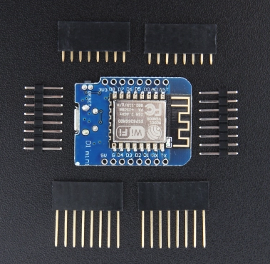

#### NodeMCU环境搭建

记录在ubunut环境上,进行lua开发

##### 硬件

* 1.mini nodemcu



* 2.mini nodemcu gpio

|IO index	| ESP8266 pin	|
|---------|------------|
|1 [*]	|GPIO17	|
|1	| GPIO5  |
|2	| GPIO4	 |
|3	| GPIO0	 |
|4	| GPIO2	 |
|5	| GPIO14 |
|6	| GPIO12 |
|7	| GPIO13 |
|8	| GPIO15 |
|9	| GPIO3  |
|11 |	GPIO9  |
|12 |	GPIO1  |

##### 软件环境

* 1.系统依赖,需要安装python, lua

````shell
sudo apt-get install -y python lua python-pip cutecom minicom git
sudo pip install esptool
````
* 2.环境搭建与编译

 * 2.1先安装java, 访问[Oracle](http://www.oracle.com/technetwork/indexes/downloads/index.html)点击`Java SE`,然后下载对应的版本(x86或者x86_64)
 * 2.2配置JDK环境
  ```
    vi /etc/profile 或者 vi ~/.profile
    追加
    JAVA_HOME=安装路径
    export PATH=$PATH:$JAVA_HOME/bin:.
  ```
  在终端执行source /etc/profile 或者 source ~/.profile
  ```
  java -version
  java version "1.8.0_151"
  Java(TM) SE Runtime Environment (build 1.8.0_151-b12)
  Java HotSpot(TM) 64-Bit Server VM (build 25.151-b12, mixed mode
  ```
  * 2.3配置编译环境,为了减少编译环境的搭建阻碍,采用docker进行编译,[参考docker官网](https://docs.docker.com/engine/installation/linux/docker-ce/ubuntu/)进行安装
  ````
  安装docker环境
  sudo apt-get remove docker docker-engine docker.io
  sudo apt-get update
  sudo apt-get install linux-image-extra-$(uname -r) linux-image-extra-virtual
  sudo apt-get update
  sudo apt-get install apt-transport-https ca-certificates curl software-properties-common
  curl -fsSL https://download.docker.com/linux/ubuntu/gpg | sudo apt-key add -
  sudo apt-key fingerprint 0EBFCD88
  sudo add-apt-repository "deb [arch=amd64] https://download.docker.com/linux/ubuntu $(lsb_release -cs) stable"
  sudo apt-get update
  sudo apt-get install docker-ce
  拉取镜像
  docker pull marcelstoer/nodemcu-build
  ````
  * 2.4安装[docker-compose](https://github.com/docker/compose/releases)
  ````
  curl -L https://github.com/docker/compose/releases/download/1.17.1/docker-compose-`uname -s`-`uname -m` -o /usr/local/bin/docker-compose
  chmod +x /usr/local/bin/docker-compose
  ````
  * 2.5拉取最新的nodemcu-firmware到指定目录,本文安装到`/opt/nodemcu-firmware`
  ````
  cd /opt/nodemcu-firmware
  git clone https://github.com/nodemcu/nodemcu-firmware.git
  ````
  * 2.6拉取镜像[进入docker仓库]()并进行编译
  ````
  拉取镜像
  docker pull marcelstoer/nodemcu-build
  配置docker-compose.yml
  nodemcu:
  image: marcelstoer/nodemcu-build
  volumes:
    - /opt/nodemcu-firmware:/opt/nodemcu-firmware
  查看编译后的固件
  ls -al /opt/nodemcu-firmware/bin/*  
  ````
* 3.固件的烧写

  * 3.0查看当前系统的串口
  ````
  sudo dmesg | grep 'tty*'
  [    0.000000] Found optimal setting for mtrr clean up
  [    0.000000] console [tty0] enabled
  [    0.553569] pciehp 0000:00:1c.0:pcie04: Slot #0 AttnBtn- PwrCtrl- MRL- AttnInd- PwrInd-   HotPlug+ Surprise+ Interlock- NoCompl+ LLActRep+
  [    0.553838] input: Power Button as   /devices/LNXSYSTM:00/LNXSYBUS:00/PNP0C0C:00/input/input0
  [    0.553841] ACPI: Power Button [PWRB]
  [    0.553861] input: Power Button as /devices/LNXSYSTM:00/LNXPWRBN:00/input/input1
  [    0.553862] ACPI: Power Button [PWRF]
  [    0.575389] 00:05: ttyS0 at I/O 0x3f8 (irq = 4, base_baud = 115200) is a 16550A
  [    0.596319] 00:06: ttyS1 at I/O 0x2f8 (irq = 3, base_baud = 115200) is a 16550A
  [    0.644312] evm: HMAC attrs: 0x1
  [    1.028338] sd 0:0:0:0: Attached scsi generic sg0 type 0
  [    1.029251] sd 0:0:0:0: [sda] Attached SCSI disk
  [    1.091701] sd 4:0:0:0: [sdb] Attached SCSI disk
  [95199.603503] usb 3-2: ch341-uart converter now attached to ttyUSB0
  本机是ttyUSB0
  ````
  * 3.1使用esptool.py进行固件烧写, 具体参考[github](https://github.com/espressif/esptool)
  ````
  sudo esptool.py --port /dev/ttyUSB0 write_flash 0x00000 /opt/nodemcu-firmware/bin/nodemcu_float_master_20171206-0603.bin
  输出日志
  esptool.py v2.2
  Connecting....
  Detecting chip type... ESP8266
  Uploading stub...
  Running stub...
  Stub running...
  Auto-detected Flash size: 4MB
  Flash params set to 0x0240
  Compressed 471792 bytes to 304668...
  Hash of data verified.
  ...
  Leaving...
  Hard resetting...
  `````
  * 3.2使用ESPlorer进行lua脚本的编译,注意启动ESPlorer需要root权限,因为需要读取/dev/ttyUSB0,下载[ESPlorer.zip](https://esp8266.ru/esplorer/) , [快速下载](http://esp8266.ru/esplorer-latest/?f=ESPlorer.zip)
  ````
  将ESPlorer.zip解压到/opt/ESPlorer目录
  sudo $JAVA_HOME/bin/java -jar /opt/ESPlorer/ESPlorer.jar
  ````
  * 3.3使用软件
  
  可视化的界面,进行操作即可, 选择串口,并点击Open.需要按一下nodemcu的rst按键,在左侧编辑区编写文件并命名为init.lua,点击Save to ESP即可,其他的功能自行摸索吧
  * 3.4说明,nodemcu默认加载init.lua文件, 可以修改`app/include/user_modules.h`进行模块选择性编译
  ````
  摘要说明
  ###### define LUA_USE_BUILTIN_STRING		// for string.xxx()
	###### define LUA_USE_BUILTIN_TABLE		// for table.xxx()
	###### define LUA_USE_BUILTIN_COROUTINE	// for coroutine.xxx()
	###### define LUA_USE_BUILTIN_MATH		// for math.xxx(), partially work
	// #define LUA_USE_BUILTIN_IO 			// for io.xxx(), partially work

	// #define LUA_USE_BUILTIN_OS			// for os.xxx(), not work
	// #define LUA_USE_BUILTIN_DEBUG
	###### define LUA_USE_BUILTIN_DEBUG_MINIMAL // for debug.getregistry() and debug.traceback()

	// The default configuration is designed to run on all ESP modules including the 512 KB modules like ESP-01 and only
	// includes general purpose interface modules which require at most two GPIO pins.
	// See https://github.com/nodemcu/nodemcu-firmware/pull/1127 for discussions.
	// New modules should be disabled by default and added in alphabetical order.
	###### define LUA_USE_MODULES_ADC
	Analog-to-Digital Converter 数模转化, ADC模块提供对内置ADC的访问在ESP8266只有一个通道，这是复用电池电压。根据“esp init data”（107字节）可以使用ADC读取外部电压，或读取system电压（vdd33），但不能同时使用。
	###### define LUA_USE_MODULES_ADS1115
	这个模块提供的ADS1115 16位精密模数转换器。用于制作逻辑分析仪。
	###### define LUA_USE_MODULES_ADXL345
	这个模块提供的ADXL345三轴加速度计。
	###### define LUA_USE_MODULES_AM2320
	这个模块提供的am2320湿度和温度传感器，使用I2C接口。
	###### define LUA_USE_MODULES_APA102
	该模块提供了Lua访问apa102 RGB LED的功能是类似通用WS2812寻址LED(ws2812是另一个)。
	###### define LUA_USE_MODULES_BIT
	位操作的支持，在32位整数。
	###### define LUA_USE_MODULES_BMP085
	这个模块提供的温度和压力传感器BMP085。该模块还与BMP180一同工作。
	###### define LUA_USE_MODULES_BME280
	这个模块提供了一个简单的接口bme280 /温度/压力/ BMP280空气湿度传感器（博世传感器）。 注意，你必须调用 init() 在读取数值之前！
	###### define LUA_USE_MODULES_COAP
	该模块根据协议CoAP协议提供了一个简单的实现。基本终端服务器部分是基于microcoap，和许多其他的代码参考libcoap。
	该模块实现客户端和服务器端。客户机部分支持GET/PUT/POST/DELETE。服务器可以注册Lua函数和变量。没有观察或发现支持。
	###### define LUA_USE_MODULES_CRON
	Cron-like 调度模块,这个模块需要RTC时间来正确操作。不要忘了包括rtctime模块。
	###### define LUA_USE_MODULES_CRYPTO
	* 密码模块提供了处理加密算法的各种功能。
	* 下面的加密/解密算法/模式支持：128位AES在ECB模式“aes-ecb”（不推荐）128位AES CBC模式“AES-CBC”
	* 下面的哈希算法的支持：- MD2（默认情况下不可用，必须开启在 app/include/user_config.h）- MD5 SHA1 - SHA256，SHA384，SHA512（除非禁止在 app/include/user_config.h 拗口, "unless disable"到底要说啥）

	###### define LUA_USE_MODULES_DHT
	官方没写~~
	//#define LUA_USE_MODULES_DS18B20
	###### define LUA_USE_MODULES_ENCODER
	编码器模块提供字节码的编码和解码的各种功能。Base64编解码, Hex编解码
	###### define LUA_USE_MODULES_ENDUSER_SETUP

	* USE_DNS in dhcpserver.h needs to be enabled for this module to work.
	* 这个模块提供了一个简单的方法来配置ESP8266芯片不使用串行接口或预编程的WiFi凭据到芯片上。貌似是用来连wifi用的

	###### define LUA_USE_MODULES_FILE
	文件模块提供对文件系统及其单个文件的访问。文件系统是一个扁平文件管理系统，没有子目录/文件夹的概念。除了在内部Flash的SPIFFS文件系统，这个模块也可以在外部SD卡的FAT分区, 如果FatFS启用的情况下。
	###### define LUA_USE_MODULES_GDBSTUB
	gdb什么的不懂
	###### define LUA_USE_MODULES_GPIO
	这个模块提供的GPIO（通用输入/输出）子系统。

	所有的访问是基于I/O的nodemcu开发套件的指数，没有内部的GPIO引脚。例如，在开发套件D0引脚映射到内部的GPIO引脚16。

	如果不使用nodemcu开发套件，请参考如下指标↔GPIO映射GPIO引脚图。

	|IO index	| ESP8266 pin	|
	|---------|------------|
	|0 [*]	|GPIO16	|
	|1	| GPIO5  |
	|2	| GPIO4	 |
	|3	| GPIO0	 |
	|4	| GPIO2	 |
	|5	| GPIO14 |
	|6	| GPIO12 |
	|7	| GPIO13 |
	|8	| GPIO15 |
	|9	| GPIO3  |
	|11 |	GPIO9  |
	|12 |	GPIO1  |

	从电路背面看从GPIO16开始是一个向下的U型结构的顺序排列的io接口
	[ * ] D0(GPIO16) 只能用于读写, 不支持开漏输出,中断,pwm, i2c和 ow

	###### define LUA_USE_MODULES_HDC1080
	这个模块提供的hdc1080低功耗、高精度的数字湿度传感器与温度传感器。
	###### define LUA_USE_MODULES_HMC5883L
	这个模块提供的HMC5883L三轴数字罗盘。
	###### define LUA_USE_MODULES_HTTP
	基本HTTP客户端模块，它提供了一个通过HTTP来 GET/POST/PUT/DELETE 的接口，以及定制的请求。由于对ESP8266内存限制，支持的page/body的大小是受可用内存的限制。试图接收大于此页的页将失败。如果较大的page/body的大小是必要的，考虑使用net.createconnection()和流。
	###### define LUA_USE_MODULES_HX711
	这个模块提供一个 HX711 load cell amplifier/ADC。hx711是一个不昂贵的24bit ADC的可编程128x，64x，32x增益。目前只信道A在128x增益的支持。
	###### define LUA_USE_MODULES_I2C
	I²C的参考设计使用一个7位元长度的位址空间但保留了16个位址，所以在一组总线最多可和112个节点通讯。常见的I²C总线依传输速率的不同而有不同的模式：标准模式（100 Kbit/s）、低速模式（10 Kbit/s），但时脉频率可被允许下降至零，这代表可以暂停通讯。而新一代的I²C总线可以和更多的节点（支援10位元长度的位址空间）以更快的速率通讯：快速模式（400 Kbit/s）、高速模式（3.4 Mbit/s）。
	虽然最大的节点数目是被位址空间所限制住，但实际上也会被总线上的总电容所限制住，一般而言为400 pF。
	###### define LUA_USE_MODULES_L3G4200D
	这个模块提供的三轴数字陀螺仪L3G4200D。
	###### define LUA_USE_MODULES_MCP4725
	###### define LUA_USE_MODULES_MDNS
	组播DNS作为卓悦/探测部分。这允许系统识别自己和他们在局域网上提供的服务。然后客户机能够发现这些系统并连接到它们。
	###### define LUA_USE_MODULES_MQTT
	客户端坚持版本3.1.1 MQTT协议。确保你的经纪人的支持是版本3.1.1正确配置。客户与经纪人运行MQTT 3.1向后兼容。
	###### define LUA_USE_MODULES_NET
	TLS操作被移动到TLS模块。
	###### define LUA_USE_MODULES_NODE
	节点模块提供对系统级功能的访问，如休眠、重启和各种信息和IDS。
	###### define LUA_USE_MODULES_OW
	单总线, 此模块提供了与单总线设备通信总线系统一起工作的功能。
	###### define LUA_USE_MODULES_PCM
	通过不同的末端播放声音。
	###### define LUA_USE_MODULES_PERF
	此模块为应用程序提供简单的性能度量。它每隔50微秒粗略地对程序计数器进行采样，并建立它所找到的值的直方图。由于只有少量的内存来存储直方图，用户可以指定哪个区域的代码是感兴趣的。默认是包含代码的整个flash。一旦确定了热点，那么可以用不同的区域和不同的分辨率重复运行，以获得所需的信息。
	###### define LUA_USE_MODULES_PWM
	脉冲宽度调制是一种模拟控制方式，其根据相应载荷的变化来调制晶体管基极或MOS管栅极的偏置，来实现晶体管或MOS管导通时间的改变，从而实现开关稳压电源输出的改变。这种方式能使电源的输出电压在工作条件变化时保持恒定，是利用微处理器的数字信号对模拟电路进行控制的一种非常有效的技术。
	###### define LUA_USE_MODULES_RC
	??
	###### define LUA_USE_MODULES_RFSWITCH
	模块操作433 / 315Mhz设备如电源插座、继电器、等，这将与所有流行的低成本电源插座插座，最有可能的工作SC5262 / SC5272, HX2262 / HX2272, PT2262 / PT2272, EV1527, RT1527, FP1527 or HS1527 芯片组
	该模块采用了一些代码从原来的遥控开关Arduino库但NodeMCU和Arduino并不完全兼容。这就要求混凝土开关被改写成rfswitch nodemcu lua的支持。
	###### define LUA_USE_MODULES_ROTARY
	这个模块可以读取廉价的旋转编码器开关的状态。这些可以在一美元或两美元的所有标准位置买到。它们是五针装置，其中三用于格雷码旋转编码器，两个用于推送开关。这些开关通常用于汽车音响系统。
	这些开关没有绝对位置，但只编码顺时针/逆时针旋转的位置数。利用该模块，连接通用的引脚上的正交编码器的地面和A和B阶段的nodemcu。一个引脚的按键开关也应该接地和其他引脚连接到nodemcu。
	###### define LUA_USE_MODULES_RTCFIFO
	的rtcfifo模块实现了一个第一，先出存储用于传感器的读数。顾名思义，它是由RTC用户内存支持的，因此可以在深睡眠周期中存活。从概念上讲，它可以被看作是时间戳、名称、值}元组的循环数组。在内部，它使用空间优化的存储格式，允许保存最多数量的样本。这有几个权衡，因此不是一个解决方案适合所有。尤其是:
	* 时间戳存储二精度。
	* 采样频率必须至少每8.5分钟一次。这是用于时间戳的delta压缩的副作用。
	* 值限制为16位精度，但有一个单独的字段存储e-N乘数。即使在使用非常小的值时，也允许高保真。有效范围在 1e-7 到 65535。
	###### define LUA_USE_MODULES_RTCMEM
	的rtcmem模块提供的RTC（实时时钟）基本访问存储器。
	在ESP8266 RTC寄存器包含内存中生存的深度睡眠，使他们保持状态，整个睡眠周期非常有用。这些记忆是保留给系统使用，但128个插槽（每个32bit宽）可申请使用。此模块提供对这些的读写访问。

	由于可用内存量非常有限，没有机构仲裁使用特定的插槽。最终用户应该知道哪些内存被用于什么，以及避免冲突。注意一些lua模块声称某些时段。
	这是一个同伴的rtctime rtcfifo模块和模块。
	###### define LUA_USE_MODULES_RTCTIME
	RTC是多种名词的缩写，如：实时时钟（Real-Time Clock）、美国资产重组托管公司（Resolution Trust Corporation）、 协作软件交付环境（IBM Rational Team Concert）、响应时间补偿（Response Time Compensation）、实时通讯（Real-time communications）、 雷达跟踪中心（Radar TrackingCentre）。
	###### define LUA_USE_MODULES_SI7021
	这个模块提供的si7021湿度和温度传感器。
	###### define LUA_USE_MODULES_SIGMA_DELTA
	此模块提供对∑-Δ组件的访问。这是一个硬件信号发生器，可以传送到任何的GPIO引脚0除外。
	###### define LUA_USE_MODULES_SJSON
	JSON支持模块。允许对JSON进行编码和解码。
	###### define LUA_USE_MODULES_SNTP
	SNTP模块实现了一个简单网络时间协议的客户端。这包括对“选播”NTP模式的支持，如果在网络中由NTP服务器支持，就不需要知道NTP服务器的IP地址。默认情况下，这将使用服务器0.nodemcu.pool.ntp.org通过3.nodemcu.pool.ntp.org。这些服务器几乎适用于几乎所有的用途。
	###### define LUA_USE_MODULES_SOMFY
	该模块提供了通过一个射频发射机的一个简单的接口来控制尚飞帘（433.42兆赫）。它是基于nickduino尚飞远程Arduino skecth。
	所使用的硬件是标准的433兆赫射频发射机。不幸的是，这些芯片通常传送在他433.92Mhz所以晶体谐振器的频率应与433.42 MHz谐振器虽然有些报道甚至与原来的晶体工作取代。
	###### define LUA_USE_MODULES_SPI
	发送和接收的所有事务都是最重要的比特优先和最不重要的最后一个。对底层硬件的技术细节是指metalphreak ESP8266 HSPI的文章。
	#define LUA_USE_MODULES_STRUCT
	该模块提供基本的设施将Lua值与C结构。它的主要功能是struct.pack，其中包多的Lua值为结构如弦；和struct.unpack，解压缩多个lua值从一个给定的结构如弦。
	#define LUA_USE_MODULES_SWITEC
	这个模块控制switec 27（或兼容）仪表步进电机。这些是现代汽车仪表中使用的步进电机。它们非常便宜，可以在你最喜欢的拍卖网站或中国购物网站上找到。有各种各样的双轴，也就是说，有两个步进电机驱动两个同心轴，所以你可以从同一个轴上安装两个针。
	#define LUA_USE_MODULES_TCS34725
	这个模块提供了一个简单的接口tcs34725颜色/光传感器（Adafruit）。注意，你必须调用setup()在读值之前
	#define LUA_USE_MODULES_TM1829
	tm1829是库处理LED灯条使用泰坦的微 tm1829 LED控制器。图书馆使用任何GPIO流LED控制命令。
	#define LUA_USE_MODULES_TLS
	* TLS模块依赖于 net 模块，它是一个必需的依赖项。
	* nodemcu包括MBED TLS库的开源版本。与nodemcu默认配置支持TLS 1 / 1.1 / 1.2和最常见的密码套件，包括DH / ECDH。ECDSA的加密套件，默认是关闭的。
	#define LUA_USE_MODULES_TMR
	tmr模块允许访问简单计时器、系统计数器和正常运行时间。它的目的是建立定期发生的任务，定时操作，并提供低分辨率三角洲。然而，tmr模块不是时间保持模块。虽然大多数超时毫秒甚至微秒表示，精度有限，复合误差会导致相当不准确的时间记录。考虑使用rtctime模块“挂钟”时间。nodemcu提供7的静态定时器，编号为0-6，动态定时器产生功能create() 。
	#define LUA_USE_MODULES_TSL2561
	tsl2561是光-数字转换器，它将光强转换成数字信号输出，具有直接I2C接口或者SMBus接口。每个设备都连接一个带宽的光敏二极管和在单独CMOS集成电路上的一个红外响应的光敏二极管，这个集成电路具有提供20bit动态范围的近-适光响应的能力。两个集成的ADCs将光敏电流转换成一个数字输出，这个数字输出表示测量每一个通道的发光。这个数字输出可以是一个微处理器的输入。
	#define LUA_USE_MODULES_U8G
	u8glib是一个图形库在olikraus / u8glib与许多不同的显示器支持开发。的nodemcu固件支持这些子集。
	#define LUA_USE_MODULES_UART
	UART（通用异步接收器/发送器）模块允许在UART串行端口上配置和通信。UART的默认设置是通过构建时间设置来控制的。默认利率是115200个基点。此外，自动波特率检测是前两分钟后平台启动。当接收到几个字符时，这将导致切换到正确的波特率。自动波特率检测时禁用uart.setup叫做。
	#define LUA_USE_MODULES_UCG
	ucglib是一个图形库在olikraus / ucglib与彩色TFT显示支持开发。的nodemcu固件支持这些子集
	#define LUA_USE_MODULES_WEBSOCKET
	* 一个WebSocket客户端模块实现rfc6455（版本13），提供了一个简单的接口发送和接收消息。实施支持零散的信息，自动响应ping请求和定期坪如果服务器没有沟通。
	* SSL / TLS支持
	* 注意在 net 模块中记录的约束。
	#define LUA_USE_MODULES_WIFI
	WiFi子系统由定期运行的后台任务来维护。任何功能或任务，需要更长的时间比15ms（毫秒）可能导致无线子系统的崩溃。为了避免这些潜在的崩溃，建议无线子系统将暂停与WiFi。suspend()之前任何任务或功能，超过这个15ms指南的执行。
	#define LUA_USE_MODULES_WPS
	WPS允许在不输入网络凭据的情况下将设备添加到现有网络中。
	#define LUA_USE_MODULES_WS2801
	ws2801灯带
	#define LUA_USE_MODULES_WS2812
	* WS2812是库处理WS2812像LED灯条。它至少在WS2812，ws2812b，apa104，sk6812（RGB或RGBW）。
	* 此库使用UART1路由gpio2（引脚D4在nodemcu devkit）产生的比特流。它可以使用UART0发送到txd0以及同时处理两LED灯条。
	* 警告：在双模式，你将失去进入Lua控制台通过串口（它将被重新配置支持WS2812协议）。如果你想保持访问Lua控制台，你可以使用另一个输入通道就像一个TCP服务器（见例子）
	#define LUA_USE_MODULES_XPT2046
	XPT2046是触摸控制器使用的一些便宜的显示器经常与ILI9341显示控制器组合。该模块是基于spapadim和paulstoffregen库的建立。
  ````


##### 参考

[1.esptool](https://github.com/espressif/esptool)
