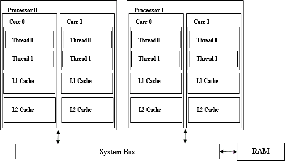
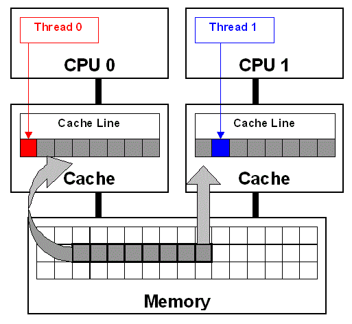
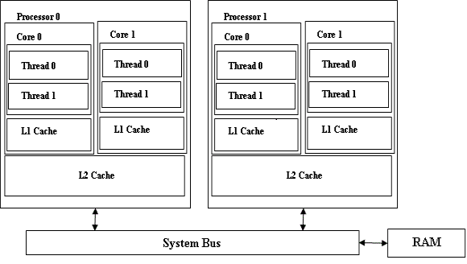

# 多核多处理器架构软件设计的注意事项

摘录[www.ibm.com](https://www.ibm.com/developerworks/cn/aix/library/au-aix-multicore-multiprocessor/index.html)

当今配备有多线程、多核、多处理器芯片的系统为软件设计人员提供了一个实现更快、更高吞吐量的机会。但是，有一些重要的设计注意事项，如果忽略了这些设计注意事项，就会导致很难发现性能问题和可伸缩性瓶颈。本文对这些重要的设计注意事项进行了讨论。

## 简介

计算硬件正在快速蓬勃发展。在时钟速度呈平稳状态的同时，晶体管密度在不断增长。处理器制造商希望通过让每个芯片拥有多个核和硬件线程来提高多处理能力。例如，[IBM POWER7®](http://en.wikipedia.org/wiki/POWER7) 对称多处理器架构通过每个核支持多达 4 个线程、每个芯片支持 8 个核、每台服务器支持 32 个芯片插槽来实现高度并行性，总共 1024 个并发硬件线程。相比之下，[IBM POWER6®](http://en.wikipedia.org/wiki/POWER6) 架构仅支持每个核 2 个线程、每个芯片 2 个核、每台服务器 32 个芯片插槽，总共 128 个并行硬件线程。

开发软件时，目前设计人员需要考虑可能会部署软件的多处理器、多核架构。这是因为：

* 通过使用更多核、硬件线程、更高的内存，应用程序应该会更好地执行和更出色地伸缩性，并能满足不断增长的性能和效率需求。
* 随着越来越多地使用多核、多处理器系统，软件设计注意事项现在应该考虑包含能够在这些计算资源之间有效地分发软件功能的方法。
* 如果在设计的过程中没有考虑这些考虑事项，那么在多处理器、多核环境中运行应用程序可能会导致严重且不易发现的性能问题。

本文将会简要介绍为多核、多处理器环境设计软件时的一些重要注意事项。

## 在芯片多线程、多核、多处理器架构上软件可伸缩性的阻碍

应用程序应该能够在多核、多处理器环境中更好地伸缩、更出色地执行。但是，如果应用程序设计的效率低下，则可能会在这样的环境中执行得较差，但通过使用可用的计算资源可以更好地伸缩和更出色地执行。这个可伸缩性的一些重要阻碍可能是：

* 效率低下的并行化：单片应用程序或软件无法有效使用可用的计算资源。您需要将应用程序组织成并行任务。在传统的不支持多线程的应用程序或软件中，我们会经常看到这个问题。这些应用程序在多核、多处理器、芯片多线程硬件上无法伸缩，并且无法实现更好的吞吐量。线程太多可能会和线程太少一样，都不会产生好的结果。
* 串行瓶颈：在多个线程或进程之间共享数据结构的应用程序可能会有串行瓶颈。为了保持数据完整性，可能必须使用锁定和串行化技术（例如，读取锁、读写锁、写入锁、自旋锁、互斥等）将这些共享数据结构的访问串行化。设计得效率低下的锁可能会由于多个线程或进程之间的高度锁争用而导致串行瓶颈，从而尝试获取锁。这可能会潜在地降低应用程序或软件的性能。应用程序的性能可能会随着核心或处理器数量的增加而降低。
* 对操作系统 (OS) 或运行时环境的过度依赖：您不能依赖操作系统、运行时环境或编译器来完成伸缩应用程序或软件所需的一切操作。但是，编译器和运行时环境可以帮助提供一定的优化，您不能依赖它们解决所有可伸缩性问题。例如，不能依赖 Java™ 虚拟机 (JVM) 通过自动并行来发现 Java 应用程序的最佳可伸缩的机会。
* 工作负载的不平衡可能是一个瓶颈：工作负载的不均匀分布可能导致无法有效地利用计算资源。您可能必须将较大的任务划分成可以并行运行的较小的任务，还可能必须将串行算法更改为并行算法，以便提高性能和可伸缩性。
* I/O 瓶颈：由于阻止磁盘输入/输出 (I/O) 或高网络延迟而导致的瓶颈可能会严重抑制应用程序的可伸缩性。
* 无效的内存管理：在多核平台上，因为有很多处理单元，因此纯计算可能非常廉价，并且主要内存可能也不是问题，因为它正在变得越来越大。但是，内存带宽一直是一个瓶颈，因为所有处理器核心都贡献了一个通用的总线。无效的内存管理可能导致一些难以检测到的性能问题，比如伪共享。

低处理器利用率可能会明确表明资源利用率未达到最佳值。为了了解性能问题，您需要评估一下应用程序是否具有太少或太多的线程，是否有锁定或同步问题、网络或 I/O 延迟、内存抖动或其他内存管理问题。只要资源是花费在有意义的工作的应用程序线程上，高处理器利用率通常都会不错。

## 芯片多线程 (CMT)、多核和多处理器 (MP) 系统概述

在讨论芯片多线程、多核、多处理器环境的设计注意事项之前，我们会简要介绍这类系统。图 1 所述的系统有两个处理器，每个处理器有两个核心，并且每个核心有两个硬件线程。每个核心有一个 L1 缓存和一个 L2 缓存。因此，每个核心可能都拥有自己的 L2 缓存，或者同一个处理器上的核心可能会共享 L2 缓存。同一个核上的硬件线程会共享 L1 和 L2 缓存。

图 1. 一个典型的芯片多线程、多核、多处理器系


所有核和处理器都共享系统总线，并通过系统总线访问主要内存或 RAM。对于应用程序和操作系统，该系统看起来就像是 8 个逻辑处理器。

以下重要概念将帮助我们了解为这样一个芯片多线程、多核、多处理器环境设计应用程序时所面临的挑战。

## 缓存一致性

缓存一致性是表示处理器缓存中的数据项目值与系统内存中的数据项目值相同的一种状态。该状态对于软件来说是透明的。但是，系统为了保持缓存一致性而执行的操作可能会影响软件的性能。

考虑这样一个示例：我们假定在图 1 所述的系统中，线程 1 正在处理器 0 上运行，而线程 2 正在处理器 1 上运行。如果这两个线程都正在读取和写入相同的数据项，那么该系统必须执行额外的操作，以确保在进行每个读取和写入操作时，线程都看到相同的数据值。

当线程 1 在与线程 2 共享的数据项中执行写入操作时，会在其处理器缓存和系统内存中更新该数据项，但不会在线程 2 处理器的缓存中立即更新数据，因为线程 2 可能不再需要访问该数据项。如果线程 2 之后访问该数据项，则其处理器上的缓存子系统必须首先从系统内存中获取新的数据值。因此，线程 1 的写入会迫使线程 2 在下次访问该数据时等待从系统内存中读取数据。仅当数据被其中一个线程修改时，才会出现这种情况。如果每个线程都进行了一系列的写入操作，那么这可能会严重影响系统的性能，因为所有时间都花费在等待更新系统内存中的数据值上。这种情况被称为“乒乓效应”，当在多处理器和多核系统上运行时，应避免发生这种情况，这是一项重要的软件设计注意事项。

## 嗅探 - Snooping

这是一个跟踪每个缓存行的状态的缓存子系统。该系统使用一个称为 “总线动态监视” 或者称为“总线嗅探” 的技术来监视在系统总线上发生的所有事务，以检测缓存中的某个地址上何时发生了读取或写入操作。

当这个缓存子系统在系统总线上检测到对缓存中加载的内存区域进行的读取操作时，它会将该缓存行的状态更改为 “**shared**”。如果它检测到对该地址的写入操作时，会将缓存行的状态更改为 “**invalid**”。

该缓存子系统想知道，当该系统在监视系统总线时，系统是否在其缓存中包含数据的惟一副本。如果数据由它自己的 CPU 进行了更新，那么这个缓存子系统会将缓存行的状态从 “**exclusive**” 更改为 “**modified**”。如果该缓存子系统检测到另一个处理器对该地址的读取，它会阻止访问，更新系统内存中的数据，然后允许该处理的访问继续进行。它还允许将该缓存行的状态标记为 **shared**。

有关这些概念的详细信息，请参阅 参考资料 部分中有关 “多核多处理器系统的软件设计问题” 的文章。

## 多核多处理器环境对软件设计决策的影响

当设计要在多核或多处理器系统上运行的软件时，主要的考虑事项是如何分配将在可用的处理器上完成的工作。分配该工作的最常用方法是使用一个线程模型，该模型可将工作分成可以在不同处理器上并行运行的各个执行单元。如果线程之间彼此完全独立，那么它们的设计无需考虑它们之间的交互方式。例如，在一个系统上运行的两个程序，每个程序都使用单独的进程在自己的核心上运行，因此无需彼此进行关注。程序的性能不会受到任何影响，除非它们争用共享的资源，比如系统内存或相同的 I/O 设备。

接下来要讨论的重点是核心和处理器与主要内存的沟通方式，以及这对软件设计决策有何影响。

请参见以下重要的设计注意事项。

## 避免内存争用

在内存和缓存中，各种不同的核共享一个通用的数据区域，这需要在它们之间进行同步。当不同的核同时访问同一个数据区域时，会发生内存争用。在不同的核之间同步数据会因总线通信、锁定成本以及缓存缺失而有很大的性能损失。

如果应用程序有多个线程，并且所有线程都更新或修改同一个内存地址，那么正如前面部分所讨论的那样，为了保持缓存一致性，可能会产生一次重大的乒乓效应。这会导致性能降低。

有关的详细信息，请参阅 参考资料 部分中 “多核平台的内存问题” 文章的 “内存争用” 部分。该文章包含一个简单的程序，此程序演示了内存争用的不良影响。该示例展示，即使多个线程之间只共享一个变量，当对更新使用原子指令时，性能损失也会很大。

## 避免内存争用的技巧

* 不要在核之间共享可写入的状态： 为了最大程度地减少内存总线通信，可以通过最小化共享位置/数据尽可能地减少核心交互，即使共享数据没有锁保护，而有一些硬件级别原子指令（如 Microsoft® Windows® 32 位平台上的 InterlockedExchangeAdd64）保护也是如此。
* 减少线程之间的内存争用的一个方法是从多个线程中消除对共享内存区域的更新。例如，即便是在多个线程需要更新全局计数器或累计总数（如统计数据）时，各个线程也可以保持线程本地总数，并让全局总数仅在需要时通过一个通用的线程进行更新。因此，在共享内存区域上的争用会大大减少。
* 趋向于减少锁争用的模式会减少内存通信，因为它是一个共享的可写入状态，该状态需要使用锁并产生争用。
* 避免由核缓存造成的伪共享。有关的详细信息，请参阅下一小节。

## 避免伪共享

如果两个或多个处理器正在向同一缓存行的不同部分中写入数据，那么很多缓存和总线通信可能会导致其他处理器上的旧行的每个缓存副本失效或进行更新。这称为 “伪共享” 或者也称为 “CPU 缓存行干扰”。和两个或多个线程共享同一数据（因此需要程序化的同步机制来确保按顺序访问）的真正共享不同，当两个或多个线程访问位于同一缓存行上的无关数据时，就会产生伪共享。

通过以下代码片段更好地了解伪共享（参考：[伪共享](http://software.intel.com/en-us/articles/false-sharing/)）。

清单 1. 用于演示伪共享的代码示例

```
double sumLocal[N_THREADS];
. . . . .
. . . . .
void ThreadFunc(void *data)
{
      . . . . . . .
      int id = p->threadId;
      sumLocal[id] = 0.0;
      . . . . . .
      . . . . . .
      for (i=0; i<N; i++)
      sumLocal[id] += p[i];
      . . . . . .
}
```
在上面的代码示例中，变量 sumLocal 的大小与线程的数量相同。数组 sumLocal 可能会导致伪共享，因为当它们修改的元素位于同一缓存行上时，多个线程会在数组中执行写入操作。图 2 演示了当在 sumLocal 中修改两个连续的元素时，线程 0 和线程 1 之间的伪共享。线程 0 和线程 1 正在修改数组 sumLocal 中连续的不同元素。这些元素在内存中彼此邻近，因此将位于同一个缓存行上。如图所示，缓存行被加载到 CPU0 和 CPU1 的缓存中（灰色箭头）。即使线程正在修改内存中的不同区域（红色和蓝色箭头），为了保持缓存一致性，在加载该缓存行的所有处理器上，该缓存行会失效，从而强制进行更新。

图 2. 伪共享（参考：参考资料部分中的避免和标识线程之间的伪共享。）


伪共享会严重降低应用程序的性能，并且很不容易检测到。有关演示伪共享不良影响的简单程序，请参阅 参考资料 部分中的文章 “多核平台 - CS Liu 的内存问题”。

## 避免伪共享的技巧

* 可以使用可用于对某个特定处理器进行有条件地编译的编译器对齐指令，通过将数据结构与缓存行边界对齐来避免伪共享。例如，在 Linux® 平台上，头文件 adm-i386/cache.h 为 Intel® x86 架构系列的 L1 缓存行大小定义了宏 L1_CACHE_BYTES。您也可以通过编程方式确定处理缓存行的大小。有关在缓存行边界上对齐数据结构以及通过编程方式创建跨平台函数以获取缓存行大小的详细信息，请参阅 参考资料 部分。
* 另一个技巧涉及对经常访问的数据结构领域进行分组，以便让它们成为单个的缓存行，因此可以通过单个内存访问来加载它们。这会减少内存延迟。但是如果数据结构非常巨大，则可能会增加缓存占用，并且可能需要牺牲一些打包效率来减少或消除伪共享。有关详细信息，请参阅 参考资料 部分中的 “缓存编程样式的元素” 文章。
* 为了防止数组中发生伪共享，应该将数组与缓存的大小匹配。结构的大小必须是处理器缓存行大小的整数倍。
* 如果需要假定缓存行大小以便强制对齐，则应使用 32 字节。请注意：
- 32 字节对齐的缓存行同时也是 16 字节对齐的缓存行。
- 在大多数处理器上，适合假定 32 字节缓存行大小。例如，IBM PowerPC® 601 名义上有一个 64 字节缓存行，但它实际上有两个已连接的 32 字节缓存行。Sparc64 有一个 32 字节 L1 和一个 64 字节 L2 缓存行。Alpha 有一个 32 字节 L1 缓存行。Itanium 架构有一个 64 字节 L1 缓存行，IBM System z® 有一个 256K L1 缓存行和 128 字节缓存行，而 x86 处理器有 64 字节 L1 缓存行。
- 在一个核上有效执行的通用规则是将数据紧紧包裹，以便该数据占用较少的空间。但在多核处理器上，包裹共享数据可能会导致严重的伪共享。通常，解决方案是紧紧包裹数据，给每个线程提供它自己的专用副本以便使其继续工作，之后再将结果进行合并。
* 线程使用了衬垫结构或数据，确保不同线程所拥有或修改的数据位于不同的缓存行上。

伪共享不容易检测，但有几个工具（如 Oprofile和Valgrind的[数据争用检测 (DRD) 模块](http://valgrind.org/docs/manual/drd-manual.html)）可以为您提供帮助。

## 消除或减少锁争用

这个设计注意事项是前面提到的两个考虑事项的扩展，目的是避免内存争用和伪共享。正如前面部分所述，软件设计者的主要目标应该是消除共享，以便线程或进程之间不会发生资源争用。前面部分中所述的一些技巧（如使用线程本地变量代替全局共享区域）可以防止发生内存争用和伪共享。但是，该技巧并不适用于所有情况。

例如，如果有一个保持资源状态的数据结构，则有可能无法在每个线程中包含该结构的副本。该数据结构可能必须由应用程序中的所有线程读取和修改。因此，必须使用同步技术来保持数据的一致性以及此类共享数据结构的完整性。如果存在用于保护共享资源的锁或同步构造，则可能会在多个线程或进程之间出现锁争用，从而降低性能。

在多核、多处理器系统上，可能有空间来同时运行大量线程或进程，但是，如果这些线程必须不断地彼此竞争，以访问或修改共享资源或数据结构，那么系统的总体吞吐量会有所降低。这会导致应用程序无法通过伸缩来有效地利用可用的计算资源。在由于锁争用而导致性能降低的极坏情况下，随着核心或处理器数量的增加，应用程序的性能会有所降低。

## 避免锁争用的技巧

* 避免在数据结构中发生锁争用的方法之一是采用并发数据结构设计和无锁算法，这会消除锁以及传统的同步技巧（比如互斥）。有多种并发数据结构的设计并不需要利用同步机制，比如互斥。有关此类并发数据结构设计的一些示例，请参阅 参考资料 部分。
* 无锁算法的一些示例如下：
 - 使用相对论编程的可伸缩并发哈希表：该技巧的最简单示例是 Read Copy Update (RCU)，它专用于 Linux 内核，大大提高了 Linux 内核的性能，并简化了 Linux 内核的代码。
 - 无锁可扩展有序分割的哈希列表：这个无锁递归可扩展哈希算法使用了无锁的链接列表，这些列表使用原子指令来修改链接的列表。
* 在Linux 内核中，广泛使用了每处理器变量，系统上的每个处理器都获得了自己的一个给定变量的副本。访问每处理器变量不需要使用锁，此外，因为在不同的处理器上，这些变量未在线程之间共享，因此没有伪共享或内存争用。这种技巧非常适合收集统计信息。

## 减少锁争用的技巧

* 当使用传统锁或同步技巧（如自旋锁）时，必须注意的是，不要使用单片锁或全局锁，而是将这些锁分成更细小的部分。因此，锁会保护数据结构中的某个特定区域以及较小的区域。这样多个线程就能够通过获取保护这些成员的相应锁，在同一数据结构的不同成员上并发进行操作。这种方法可以实现更多并发。
* 甚至当软件设计中的同步机制能够实现更好的并发和减少锁争用时，也可能会由于伪共享而导致发生性能问题。例如，考虑一个哈希数据结构。如果存在一个自旋锁数组，用于保护哈希中的每个哈希桶，那么在自旋锁数组中可能会出现伪共享。两个线程在两个不同的处理器上运行，每个线程都锁定哈希中的不同哈希桶，那么当它们所需的自旋锁位于同一个缓存行上时，可能会发生伪共享。因此，在设计此类算法时需要考虑采用避免发生伪共享的通用技巧。

检测锁争用以及消除或减少锁争用对于在多核、多处理器环境中提供应用程序的可伸缩性非常重要。操作系统提供了用于检测和度量由于锁争用而导致性能瓶颈的实用工具。例如，Solaris 提供了 Lockstat 实用工具，用于度量内核模块中的锁争用。同样，Linux 内核也提供了 Lockstat 和 Lockdep 框架，用于检测和度量锁争用以及性能瓶颈。"Windows 性能工具包 - Xperf" 在 Windows 上提供了类似的功能。有关的详细信息，请参阅 参考资料 部分。

## 避免堆争用

C/C++ 标准内存管理例程是使用特定于平台的内存管理 API 实现的，它通常基于堆的概念。这些库例程（无论是单线程版本还是多线程版本）在单个堆上分配或释放内存。它是全局资源，在某个进程中的线程之间共享并争用。堆争用是内存密集型多线程应用程序的瓶颈之一。

## 避免堆争用的技巧

* 使用线程本地/专用堆进行内存管理，从而消除了资源争用。在 Windows 平台上，可以使用 HeapCreate() 为每个线程创建一个专用堆，并将返回的堆句柄传递给 HeapAlloc()/HeapFree() 函数。

参考资料 部分中的 “多核平台的内存问题 - CS Liu” 文章提供了一个堆争用示例。在这个参考资料中，作者演示了如何使用专用堆将性能提高3倍左右（与使用全局堆相比）。

## 注意：
* 在 Windows 平台上，当创建堆时，可以设置 heap_no_serialization 标志，这意味着从多个线程访问它时不需要进行同步。但事实证明，在 vista 及更高版本的操作系统上，将该标志设置为线程私有堆速度会很慢。
* Heap_no_serialization 和一些调试方案将禁用 “Low Fragment Heap” 功能，现在这是堆的事实默认策略，因此进行了高度优化。

## 提高处理器关联

处理器关联是一个线程或进程属性，该属性告诉操作系统可以在哪些核或逻辑处理器上运行进程。这更适合嵌入式软件设计。

图 3 显示了一个系统配置，该配置包含两个处理器，每个处理器有两个核，这两个核都有一个共享的 L2 缓存。在该配置中，在同一处理器上的两个核之间以及不同处理器上的两个核之间，缓存子系统的行为将会有所不同。如果两个相关的进程或某个进程的两个相关线程被分配给同一处理器上的两个核，那么它们可以更好地利用共享的 L2 缓存，而且可以减少保持缓存一致性的开销。


## 设计注意事项

* 嵌入式系统的软件设计者可以利用这个保持缓存一致性相对较低的开销，通过编程控制向核分配线程。
* 在Linux和Windows操作系统上的以下系统调用可以告诉应用程序，对于特定的进程来说，处理器是如何关联的，并为进程设置处理器关联掩码：

清单 2. 用于管理处理器关联的系统调用

```
Linux Example:
/* Get a process' CPU affinity mask */
extern int
sched_getaffinity(pid_t pid, size_t cpusetsize, cpu_set_t *cpuset);

/* Set a process's affinity mask */
extern int
sched_setaffinity(pid_t pid, size_t cpusetsize, const cpu_set_t *cpuset);

Windows Example:
/* Set processor affinity */
BOOL WINAPI
SetProcessAffinityMask(Handle hProcess, DWORD_PTR dwProcessAffinityMask);

/* Set Thread affinity */
DWORD_PTR WINAPI
SetThreadAffinityMask(Handle hThread, DWORD_PTR dwThreadAffinityMask);
```

## 编程模型

当为应用程序中的线程分配工作时，软件设计者可以考虑两个不同的编程模型。它们是：

* 功能分解
 - 该模型的目标是了解应用程序或软件必须执行的操作，并将每个操作分配给不同的线程。
 - 可以将多个操作组合在一个线程中，但功能分解的结果是每个操作都由特定的线程来执行。
* 域分解或称为数据分解
 - 该模型的目标是分析软件或应用程序所需的数据集，以便对它们进行管理或处理，并将这些数据集分解成可以单独处理的较小组件。
 - 软件中的线程会重复要执行的操作，但每个线程将在单独的数据组件上执行操作。

软件所需的操作类型以及数据特性都会影响模型的选择，但是必须了解这些模型如何在多处理器或多核环境中执行。

## 软件设计者需要考虑的几个注意事项

* 尽管数据分解中的缓存交互看似非常简单（意味着数据分解优于功能分解），但支持域分解所需的软件设计可能面临非常大的挑战。
* 分解模型中的数据仍然需要位于不同的缓存行上，以避免出现伪共享的可能。

在 参考资料部分中的多核多处理器系统的软件设计问题参考文献中，详细介绍了编程模型、为多核多处理器架构进行软件设计时应用这些模型的挑战和优势。

## 结束语

本文简要介绍了多核多线程环境的特性，还介绍了在多核多处理器系统上可能导致降低应用程序性能或妨碍应用程序可伸缩性的一些重要问题，讨论了在这样的环境中设计软件时的一些重要考虑事项和技巧。考虑了这些考虑事项而设计的软件或应用程序可以有效地利用可用的计算资源，还可以避免性能和可伸缩性问题。
