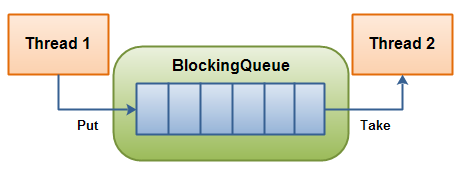
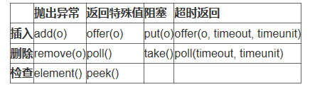
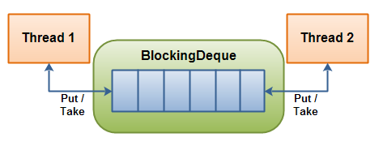
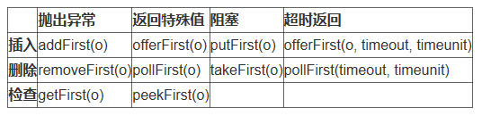
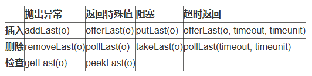
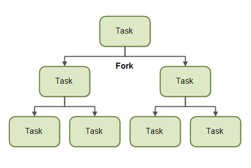
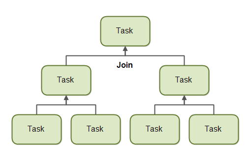
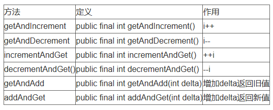
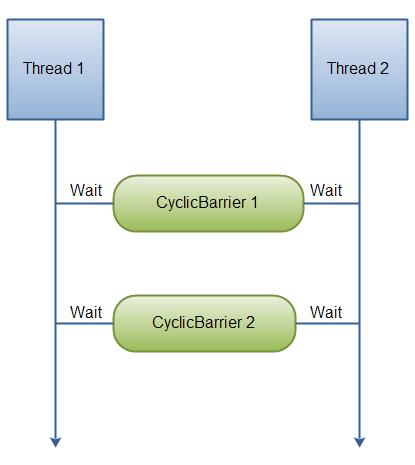
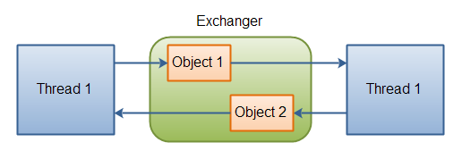

# Java 8并发工具包漫游指南

## Java 8并发工具包简介

Java 8并发工具包由3个包组成，分别是java.util.concurrent、java.util.concurrent.atomic和java.util.concurrent.locks，提供了大量关于并发的接口、类、原子操作类、锁相关类。借助java.util.concurrent包，可以非常轻松地实现复杂的并发操作。java.util.concurrent包主要包含以下内容，后文将具体介绍：

- 阻塞队列：多种阻塞队列的实现，在队列为空或满时能够阻塞消费者或生产者相关线程。
- 并发容器：用于并发场景的容器类型，一般无需加锁。
- 线程池：创建单线程、固定大小或可缓存的线程池，支持周期性任务，也能够实现异步任务的返回。
- 锁：用于并发同步的锁；
- 原子类型：用于实现原子操作的数据类型，包括AtomicBoolean、AtomicInteger、AtomicLong、AtomicReference等
- 并发工具：用于并发场景的类，可以控制并发线程的同步、等待。

## 阻塞队列BlockingQueue

在BlockingQueue中，生产者可以持续向队列插入新的元素，直到队列满为止，队列满后生产者线程被阻塞；消费者可以持续从队列取出元素，直到队列空为止，队列空后消费者线程被阻塞。

BlockingQueue提供了四种类型的操作方法，在操作不能立即执行的情况下有不同的表现。

### Java 8提供了多种类型的BlockingQueue实现类，
- ArrayBlockingQueue：基于数组实现的有界阻塞队列，创建后不能修改队列的大小；
- LinkedBlockingQueue：基于链表实现的有界阻塞队列，默认大小为Integer.MAX_VALUE，有较好的吞吐量，但可预测性差。
- PriorityBlockingQueue：具有优先级的无界阻塞队列，不允许插入null，所有元素都必须可比较（即实现Comparable接口）。
- SynchronousQueue：只有一个元素的同步队列。若队列中有元素插入操作将被阻塞，直到队列中的元素被其他线程取走。线程池
- DelayQueue：无界阻塞队列，每个元素都有一个延迟时间，在延迟时间之后才释放元素。

## 阻塞双端队列BlockingDueue

Dueue是“Double Ended Queue”的缩写。生产者和消费者可以在队列的两端进行插入和删除操作。

在头部提供了四种类型的操作方法，在操作不能立即执行的情况下有不同的表现。

在尾部提供了四种类型的操作方法，在操作不能立即执行的情况下有不同的表现。

### Java 8只提供了一种类型的BlockingDueue实现类，

LinkedBlockingDeque：基于双向链表实现的有界阻塞队列，默认大小为Integer.MAX_VALUE，有较好的吞吐量，但可预测性差。

## 阻塞转移队列TransferQueue

TransferQueue接口继承了BlockingQueue接口，因此具有BlockingQueue接口的所有方法，并增加了一些方法。方法及作用如下：

- tryTransfer(E e)：若当前存在一个正在等待获取的消费者线程，则该方法会即刻转移e，并返回true；若不存在则返回false，但是并不会将e插入到队列中。这个方法不会阻塞当前线程，要么快速返回true，要么快速返回false。
- transfer(E e)：若当前存在一个正在等待获取的消费者线程，即立刻将e移交之；否则将元素e插入到队列尾部，并且当前线程进入阻塞状态，直到有消费者线程取走该元素。
- tryTransfer(E e, long timeout, TimeUnit unit)：若当前存在一个正在等待获取的消费者线程，会立即传输给它; 否则将元素e插入到队列尾部，并且等待被消费者线程获取消费掉。若在指定的时间内元素e无法被消费者线程获取，则返回false，同时该元素从队列中移除。

Java 8 提供了一个基于链表的实现类LinkedTransferQueue。

## 并发容器

工具包提供了队列的并发实现类ConcurrentLinkedQueue和ConcurrentLinkedDeque，两者都是无界非阻塞线程安全的队列。

ConcurrentMap接口继承了普通的Map接口，提供了线程安全和原子操作特性。Java 8 提供了实现类ConcurrentHashMap，ConcurrentHashMap不锁定整个Map，只锁定需要写入的部分，因此并发性能比HashTable要高很多。

ConcurrentNavigableMap接口继承了ConcurrentMap和NavigableMap接口，支持并发访问NavigableMap，还能让子Map具备并发访问的能力。NavigableMap是扩展的 SortedMap，具有了针对给定搜索目标返回最接近匹配项的导航方法。

Java 8 提供了实现类ConcurrentSkipListMap，并没有使用lock来保证线程的并发访问和修改，而是使用了非阻塞算法来保证并发访问，高并发时相对于TreeMap有明显的优势。

工具包提供了NavigableSet的并发实现类ConcurrentSkipListSet，是线程安全的有序集合，适用于高并发的场景，通过ConcurrentSkipListMap实现。

工具包提供了两个写时复制容器，即CopyOnWriteArrayList和CopyOnWriteArraySet。写时复制技术是一种优化策略，多个线程可以并发访问同一份数据，当有线程要修改时才进行复制然后修改。在Linux系统中，fork进程后，子进程先与父进程共享数据，需要修改时才用写时复制得到自己的副本。在Java中，写时复制容器在修改数据后，把原来容器的引用指向新容器，来实现读写分离，在并发读写中不需要加锁。写时复制容器适用于读多写少的场景，在复制时会占用较多内存，能够保证最终一致性，但无法保证瞬时一致性。

## 线程池

工具包中Executor接口定义了执行器的基本功能，即execute方法，接收Runnable对象参数并执行Runnable中的操作。

ExecutorService接口继承Executor接口后增加了关于执行器服务的定义，如关闭、立即关闭、检查关闭、等待终止、提交有返回值的任务、批量提交任务等。通过Executors的工厂方法获取ExecutorService的具体实现，目前Executors可以返回的实现类型如下：

- FixedThreadPool：固定大小的线程池，创建时指定大小；
- WorkStealingPool：拥有多个任务队列（以便减少连接数）的线程池；
- SingleThreadExecutor：单线程执行器，顾名思义只有一个线程执行任务；
- CachedThreadPool：根据需要创建线程，可以重复利用已存在的线程来执行任务；
- SingleThreadScheduledExecutor：根据时间计划延迟创建单个工作线程或者周期性创建的单线程执行器；
- ScheduledThreadPool：能够延后执行任务，或者按照固定的周期执行任务。

如果希望在任务执行完成后得到任务的返回值，可以调用submit方法传入Callable任务，并通过返回的Future对象查看任务执行是否完成，并获取返回值。

## 线程分叉与合并

ForkJoinPool 让我们可以很方便地把任务分裂成几个更小的任务，这些分裂出来的任务也将会提交给 ForkJoinPool。任务可以继续分割成更小的子任务，只要它还能分割。分叉和合并原理包含两个递归进行的步骤。两个步骤分别是分叉步骤和合并步骤。

一个使用了分叉和合并原理的任务可以将自己分叉(分割)为更小的子任务，这些子任务可以被并发执行。如下图所示：

通过把自己分割成多个子任务，每个子任务可以由不同的 CPU 并行执行，或者被同一个 CPU 上的不同线程执行。

只有当给的任务过大，把它分割成几个子任务才有意义。把任务分割成子任务有一定开销，因此对于小型任务，这个分割的消耗可能比每个子任务并发执行的消耗还要大。

什么时候把一个任务分割成子任务是有意义的，这个界限也称作一个阀值。这要看每个任务对有意义阀值的决定。很大程度上取决于它要做的工作的种类。

当一个任务将自己分割成若干子任务之后，该任务将等待所有子任务结束。一旦子任务执行结束，该任务可以把所有结果合并到同一个结果。图示如下：

## 锁

使用锁实现的同步机制很像synchronized块，但是比synchronized块更灵活。锁和synchronized的主要区别在于：
- Synchronized块不能保证等待进入块的线程的访问顺序；
- Synchronized块无法接收参数，不能在有超时时间限制的情况下尝试访问；
- Synchronized块必须包含在单个方法中，而锁的lock和unlock操作可以在单独的方法中。

工具包提供了以下几种类型的锁：

- ReadWriteLock：读写锁接口，允许多个线程读取某个资源，但是一次只能有一个线程进行写操作。内部有读锁、写锁两个接口，分别保护读操作和写操作。实现类为ReentrantReadWriteLock。
- ReentrantLock：可重入锁，具有与使用 synchronized 方法和语句所访问的隐式监视器锁定相同的一些基本行为和语义，但功能更强大。ReentrantLock 将由最近成功获得锁定，并且还没有释放该锁定的线程所拥有。当锁定没有被另一个线程所拥有时，调用 lock 的线程将成功获取该锁定并返回。如果当前线程已经拥有该锁定，此方法将立即返回。内部有一个计数器，拥有锁的线程每锁定一次，计数器加1，每释放一次计数器减1。

## 原子类型

工具包提供了一些可以用原子方式进行读写的变量类型，支持无锁线程安全的单变量编程。

本质上，这些类都扩展了volatile的概念，使用一个volatile类型的变量来存储实际数据。

工具包提供了4种类型的原子变量类型：
- AtomicBoolean：可原子操作的布尔对象；
- AtomicInteger：可原子操作的整形对象；
- AtomicLong：可原子操作的长整形对象；
- AtomicReference：可原子操作的对象引用。

以AtomicInteger为例。在Java中i++和++i操作并不是线程安全的，需要加锁。AtomicInteger提供了以下几种线程安全的操作方法：

在此基础上，工具包还提供了原子性的数组类型，包括AtomicIntegerArray、AtomicLongArray、AtomicReferenceArray。

## 并发工具

- CountDownLatch: CountDownLatch用于一个或者多个线程等待一系列指定操作的完成。初始化时，给定一个数量，每调用一次countDown() 方法数量减一。其他线程调用await方法等待时，线程会阻塞到数量减到0才开始执行。
- CyclicBarrier栅栏: CyclicBarrier是一种同步机制，它能够对处理一些算法的线程实现同步。换句话讲，它就是一个所有线程必须等待的一个栅栏，直到所有线程都到达这里，然后所有线程才可以继续做其他事情。在下图的流程中，线程1和线程2都到达第一个栅栏后才能够继续运行。如果线程1先到线程2后到，则线程1需要等待线程2到达栅栏处，然后两个线程才能继续运行。

### Exchanger 交换机

Exchanger类表示一种会合点，两个线程可以在这里交换对象。两个线程各自调用exchange方法进行交换，当线程A调用Exchange对象的exchange()方法后，它会陷入阻塞状态，直到线程B也调用了exchange()方法，然后以线程安全的方式交换数据，之后线程A和B继续运行。

### Semaphore 信号量

Semaphore 可以很轻松完成信号量控制，Semaphore可以控制某个资源可被同时访问的个数，通过 acquire() 获取一个许可，如果没有就等待，而 release() 释放一个许可。

### ThreadLocalRandom产生并发随机数

使用Math.random()产生随机数，使用原子变量来保存当前的种子，这样两个线程同时调用序列时得到的是伪随机数，而不是相同数量的两倍。ThreadLocalRandom提供并发产生的随机数，能够解决多个线程发生的竞争争夺。
